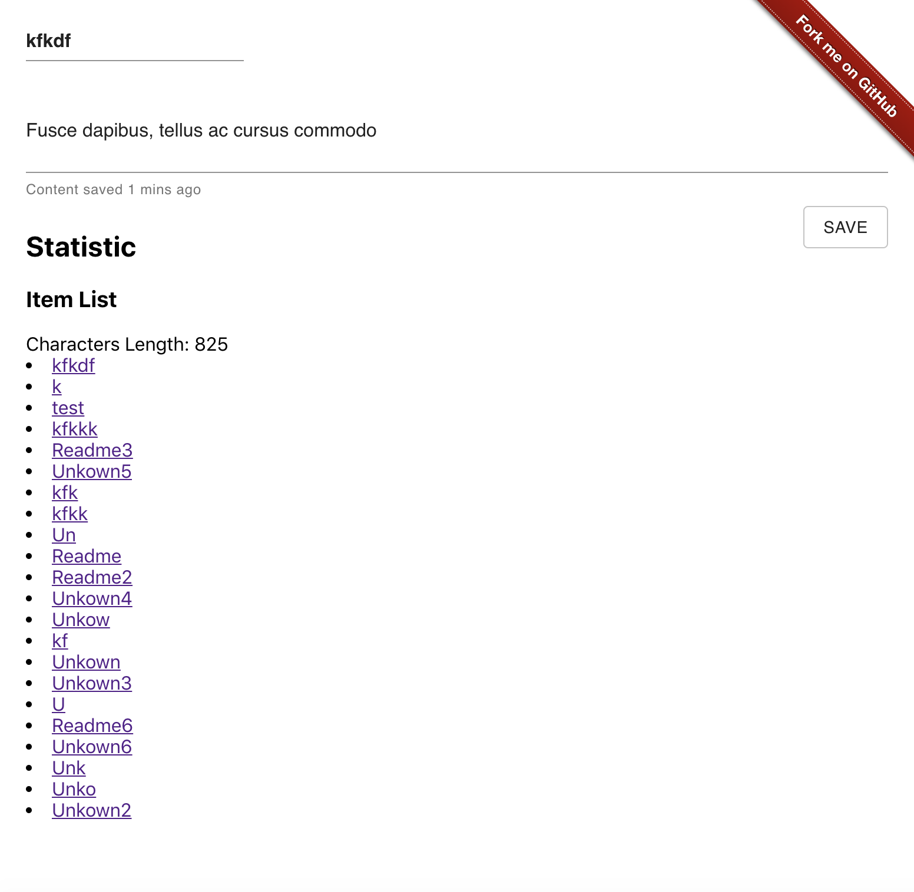

# pen



A simple CMS system.

## Introduction

Most CSM provide complicate template system for customization and impresss audiences. They are all great, but this
project would focuse on content and the creator especially the programmers. I want to help them to create and update
the content in the most efficent way.

## Usage

```
git clone
npm install
npm start
```

## About Me

I am a Senior Software Engineer in San Francisco. I got involved with many projects across different industries and
countries, including but not limited to Xero fin tech SaaS Expense system, Huawei AI Robot, Facebook IoT Portal Smart
Device, TRS CMS (Content Management System), DA (Data Analysis) and big data mining, E-Commerce Magento, WordPress and
Drupal CMS, Tencent Discuz forum social media and etc.

## Purpose

So far we still don't have clear standard to define the domain. Each industry would have their own terminology, they
don't share well with each other. Eg. A "Modal", it could be 3D Modal, Data Modal or maybe Business Modal. I wish my
project can resolved the problem.

## Practice

There are few thing you can use this project to practice.

1. CMS, you can publish your content with this program.
2. ECommerce, you can also use this program to sale your product or service.

## Contributing

Welcome to contribute to this project in any kind of forms, code, promiting, or etc.
